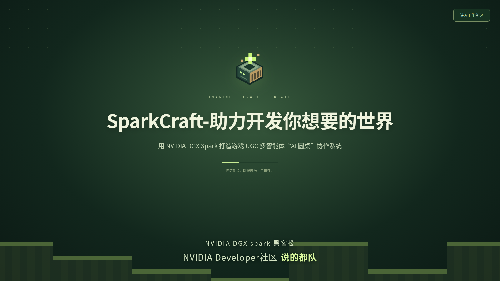
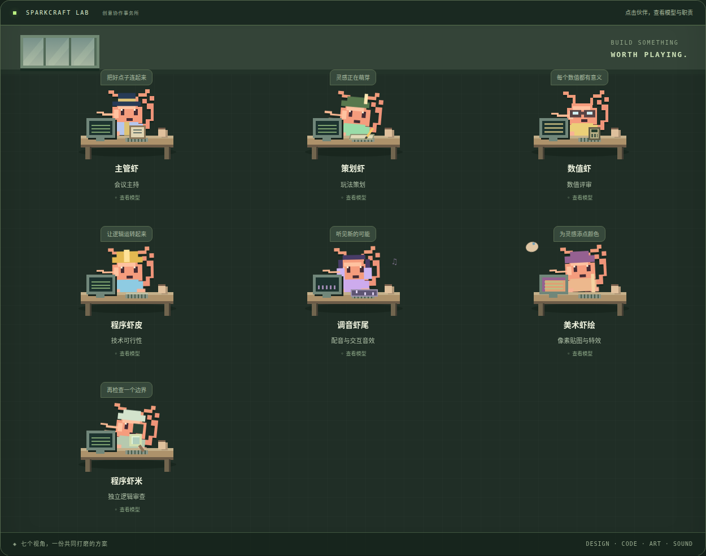
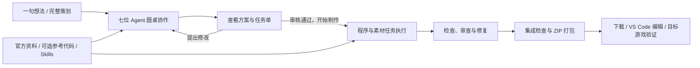

<div align="center">



# SparkCraft 1.2

### 助力开发你想要的世界

用 NVIDIA DGX Spark 打造游戏 UGC 多智能体「AI 圆桌」协作系统。

**七位专业伙伴 · 本地模型协作 · Minecraft 中国版开发 · 人工审核后制作**

[快速开始](#快速开始) · [认识七位伙伴](#认识七位伙伴) · [创作流程](#从想法到模组文件) · [项目文档](#项目文档)

**NVIDIA DGX Spark 黑客松 · NVIDIA Developer社区说的都队**

</div>

## SparkCraft 是什么？

一个模组的诞生，需要的不只是代码：玩法要有完整的交互逻辑，数值要能支撑体验，贴图和声音需要遵守资源规范，程序还要正确接入游戏接口。

SparkCraft 将这些开发职责组织成一间像素风格的 AI 创作工作室。你可以带来一句玩法想法，也可以直接粘贴完整策划；七位有不同装扮与动作的「虾米伙伴」围绕同一个方案讨论，从各自的专业角度补充细节。你能查看讨论过程、提出修改，并在认可任务单后批准制作。

项目以 **DGX Spark 上的本地模型与 OpenClaw** 为协作基础，当前主要面向 **Minecraft 中国版 ModSDK 开发**。官方文档、用户上传的参考代码与专业 Skills 为 Agent 提供实现依据；生成代码在独立工作区中检查和修复，通过交付检查后输出 ZIP，方便下载并在 VS Code 中继续开发。

**SparkCraft 的目标，是把需求、讨论、开发与交付连接起来，让创作者看清每一步发生了什么。**

## 认识七位伙伴



*截图来自 1.2 版的全新工作区，展示真实界面；未使用历史任务、私有资料或模拟对话展示开发成果。封面取自系统开屏画面。*

| 圆桌成员 | 专业职责 | 为方案带来什么 |
| --- | --- | --- |
| **主管虾** | 主持与协调 | 明确范围、组织讨论、整合意见，形成供人审核的方案 |
| **策划虾** | 玩法策划 | 梳理玩家流程、状态变化、交互规则与验收场景 |
| **数值虾** | 数值设计 | 推敲奖励、概率、冷却、成长与边界条件 |
| **程序虾皮** | 技术可行性 | 对照 ModSDK 资料，检查端别、接口与实现路径 |
| **调音虾尾** | 配音与音效 | 规划 NPC 台词、物品音效、交互声音及播放规则 |
| **美术虾绘** | 贴图与特效 | 规划像素资源、UI 九宫格与序列帧，明确资源接入要求 |
| **程序虾米** | 独立逻辑审查 | 检查重复触发、状态清理、异常处理和方案遗漏 |

点击办公室中的成员，可以查看职责、当前文本模型并配置模型路由。七位成员共同参与方案讨论；批准制作后，**程序虾仁**承担实际代码生成与修复工作。音频生成模型与圆桌讨论模型分开配置。

## 为什么使用 SparkCraft？

- **分工清晰的协作过程**：策划、数值、程序、美术和音效围绕同一需求沟通，讨论记录按轮次查看。
- **把决定权交给创作者**：讨论后可以提出修改；人工批准任务单后进入制作，修复沿用已批准的需求。
- **以官方资料作为开发依据**：内置网易开发资料入口和核验规则，支持同步参考资料、上传离线文档与代码库。
- **让项目经验可以复用**：代码索引提供带来源的参考片段；Skills 持续学习功能可生成带源码引用的经验补充，支持暂停和回滚。
- **本地与云端按需搭配**：本地文本推理通过 OpenClaw 接入，也可以配置云端模型；StepFun 用于可选的音频生成。
- **交付可继续编辑的文件**：制作过程显示进度与检查结果，通过检查后提供 ZIP，代码可在 VS Code 中继续打磨。

## 从想法到模组文件



1. 在「代码库与知识 → 我的世界」查看官方资料，按需上传代码库或离线开发文档。参考代码上传是可选项。
2. 在「开发工作台」选择「只有想法」或「已有完整策划」，提交需求。
3. 进入圆桌观看讨论，查看各轮方案；不满意时提出修改建议，继续讨论。
4. 核对制作范围、目标版本及素材需求，点击「审核通过，开始制作」。
5. 查看制作进度、自动修复与交付状态；完成后下载 ZIP，在目标游戏环境验证效果。

当前目标版本标签为 **Minecraft 中国版基岩 1.24**。具体 ModSDK 接口和游戏效果仍需在目标开发环境验证，静态检查与模型审查不能代替游戏实测。

## 快速开始

面向 DGX Spark 的 Linux ARM64 环境，准备 Python 3.12+ 与 venv、Docker、NVIDIA 驱动及 NVIDIA Container Toolkit。首次部署需要联网下载依赖、容器与模型权重。

完整下载并解压仓库，在项目目录打开终端：

```bash
chmod +x *.sh
./一键部署.sh --dry-run   # 预览部署动作
./一键部署.sh            # 准备依赖、连接或部署模型、启动工作台
```

以后直接运行：

```bash
./启动.sh                 # 检测模型和 OpenClaw，打开系统默认浏览器
./后台监控.sh             # 查看并记录本项目服务健康状态
./结束.sh                 # 结束本项目服务，不停止共享模型服务
./安装桌面快捷方式.sh      # 为当前位置生成可双击入口
```

工作台地址：**http://127.0.0.1:8765/studio**。

默认端口：本地模型 `8000`、项目 OpenClaw Gateway `19789`、Studio `8765`。启动过程按阶段显示进度，已经就绪的服务会被复用。若另一目录的 SparkCraft 占用 8765，启动器可能打开原实例，界面与数据仍属于原目录。

Linux 文件管理器可能将双击 `.sh` 解释为打开文本；可在终端执行 `bash 启动.sh`，或安装桌面快捷方式。移动目录后需要重新生成快捷方式。

完整步骤见 [DGX Spark 部署指南](docs/DGX-Spark部署.md) 与 [部署说明](docs/部署说明.md)。

## 模型、知识与 Skills

| 能力 | 当前接入方式 |
| --- | --- |
| 圆桌讨论与代码制作 | 本机 OpenClaw；部署脚本默认配置 Nemotron 3.5 Lightning，也支持用户配置模型路由 |
| 云端文本模型 | 在工作台填写服务地址、模型与 API 凭证，按角色选择 |
| NPC 配音与交互音效 | 调音虾尾的音频 API 配置入口；默认 `stepaudio-3-gen-preview`，需自备 StepFun 密钥 |
| 美术多模态模型 | 已有 API 配置入口；图像生成适配器尚未启用，属于测试版能力 |
| 官方知识 | [网易官方 API](https://mc.163.com/dev/apidocs.html) 与 [开发指南](https://mc.163.com/dev/guide.html)，支持同步和离线资料导入 |
| Skills 持续学习 | 从上传代码中提炼带来源的经验补充，属于测试版；不是训练或修改模型权重 |

专业技能位于 [`skills/`](skills/)，覆盖主持、策划、数值、可行性、编码、审查、美术、音效与知识复用。知识索引和经验可以帮助 Agent 查找依据，但不保证代码库越多就一定没有 bug。

选择云端模型后，对应上下文会发送到用户配置的服务。密钥保存在本机私有目录，不应写入 README、Skills 或提交到 GitHub。

## 当前范围

- 重点支持 Minecraft 中国版开发过程，不包含联机运维、地图制作、账号、上架与收益流程。
- 其他游戏入口保留为未来更新方向。
- 美术 Agent 已参与讨论并提供资源规范；必需的新生成图像尚不能由当前适配器完成。
- 模型可能产生错误接口或不完整实现。系统提供检查和修复流程；未通过时保留问题，不把失败产物标为完成。
- 发布包不含模型权重、运行时、用户代码、会议记录、历史测试内容或 API 密钥；下载后需要按说明部署。

## 项目文档

| 文档 | 内容 |
| --- | --- |
| [项目说明文档](docs/项目说明文档.md) | 作品特点、核心亮点、技术实现与优化方案 |
| [部署说明](docs/部署说明.md) | 本地算力部署、模型配置与 Agent Skills 设计 |
| [技术栈说明](docs/技术栈说明.md) | NVIDIA 相关组件、模型与 StepFun 接入说明 |
| [架构说明](docs/architecture.md) | 系统组成与数据流 |
| [人工审核与交付](docs/approved-delivery.md) | 任务单、制作流程与产物检查 |
| [官方知识库范围](docs/minecraft-guide-cache.md) | 资料来源、缓存和版本边界 |
| [代码与知识学习](docs/repository-learning.md) | 导入、索引与经验复用 |

```text
roundtable/          服务端与 Studio 界面
skills/              Agent 技能与专业参考资料
knowledge/           官方资料导航与核验规则
scripts/             Linux 启动、部署与发布工具
docs/                项目、部署与技术文档
  images/            README 封面与真实界面截图
```

重新生成干净的发布目录：

```bash
.venv/bin/python scripts/package_release.py --github --version 1.2.0 --output ../SparkCraft-1.2发布包
```

发布工具不会包含本机 `data/`、已安装运行时和模型权重，且拒绝覆盖已有目标目录。首次部署产生的数据留在各使用者自己的设备上。

---

项目设计起点：[NVIDIA 技术博客：游戏 UGC AI 圆桌](https://developer.nvidia.cn/blog/spark-ugc-ai-roundtable/)。

**SparkCraft · 让每个世界，始于你的一个想法。**
