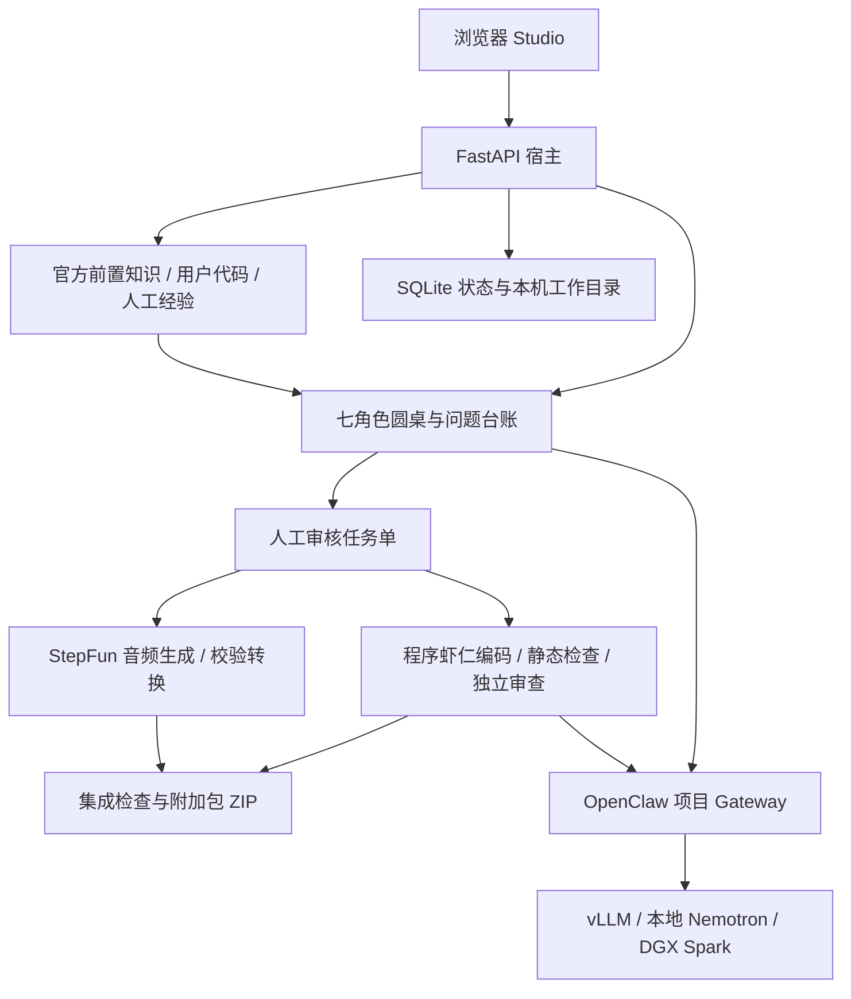

# SparkCraft 1.2 架构说明

当前完整技术实现与优化说明见[项目说明文档](项目说明文档.md)、[部署说明](部署说明.md)及[技术栈说明](技术栈说明.md)。本页替换旧版五角色、仅方案讨论的历史描述。

- `engine.py`：轮次、问题归属、预算、取消与持久化。配置3–1000轮；单次上下文最多1M token，累计用量独立统计。
- `providers.py`、`agent_models.py`、`cloud_models.py`：真实/模拟模式分离，角色路由与云端连接。
- `skills.py`、`skills/`：角色专业规范、示例与输入指纹。
- `official_knowledge.py`、`knowledge.py`、`documents.py`：默认资料、项目检索与文档识别。
- `development.py`：独立工作目录、文件约束、静态验证、评审和有界修复。
- `delivery.py`、`audio_generation.py`：批准版本、音频制作、资源集成与打包。
- `export_safety.py`：导出前检查已知凭证及疑似秘密内容。

云端文本模型可直接走兼容API，不必经过本地推理服务。人工审批是制作入口，不等于游戏验收；打包状态仍明确要求目标客户端验证。源代码和文档作为数据处理，不获得修改系统指令或执行任意命令的权限。
