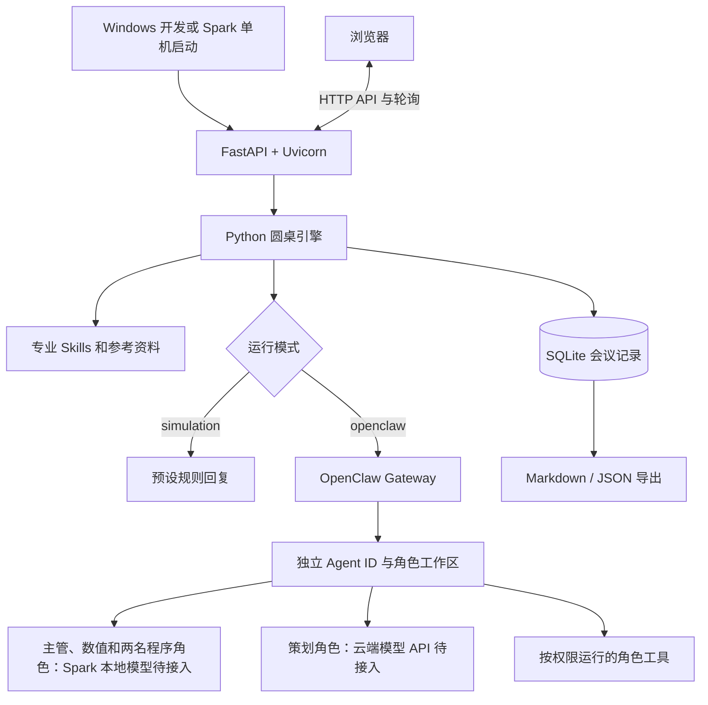

# Minecraft UGC AI 圆桌：项目说明与使用手册

文档日期：2026-09-13。项目版本：0.1.0。

当前项目根目录：`F:\spark-game`。本文中的相对路径均从这个目录开始计算。

本项目用 Python 从零重新实现多角色模组设计评审，沿用两篇博客的圆桌协作思路。当前默认是明确标注的规则模拟；OpenClaw 接口已经实现，Spark 真机与真实模型仍待接入。

## 1. 先看这四个文件

| 文件 | 位置 | 用途 |
| --- | --- | --- |
| 本手册 | `F:\spark-game\项目说明与使用手册.md` | 功能、技术、目录、操作、部署与排错说明 |
| [启动圆桌.cmd](启动圆桌.cmd) | 项目根目录 | 双击启动后台服务，就绪后打开本地网页 |
| [彻底关闭圆桌.cmd](彻底关闭圆桌.cmd) | 项目根目录 | 正常关闭；超时则结束经身份核验的本项目进程 |
| [查看日志和状态.cmd](查看日志和状态.cmd) | 项目根目录 | 显示状态和最新日志，每 2 秒检查变化 |

日常操作：双击启动 → 浏览器使用圆桌 → 需要排错时打开日志脚本 → 用关闭脚本结束服务。

启动窗口里的“按任意键继续”只用于关掉提示窗口，后台服务会继续运行。关闭浏览器也不会自动停止服务。日志查看窗口按 `Ctrl+C` 退出查看，不会关闭圆桌；在批处理窗口中可能还需确认结束批处理。

## 2. 项目要实现什么

面向网易《我的世界》中国版基岩 ModSDK 开发，把一个玩法需求交给不同专业角色逐轮评审，最后得到可交给开发者继续实现的设计方案和讨论记录。

例如提出“收集指定物品后领奖”的任务玩法，圆桌分别检查：玩法是否清楚、奖励与冷却是否合理、客户端与服务端怎么分工、断线或重复点击是否会造成重复发奖。主管汇总问题、修改方案，再交给相关角色复核。

当前产出是设计方案、数值建议、技术可行性意见、未解决问题和会议记录。完整可玩模组、游戏运行截图及实机性能报告需要另外开发和验证。

### 2.1 原思路在本项目中的保留和调整

| 项目 | 当前做法 |
| --- | --- |
| 多专业角色讨论 | 保留 |
| 主管整理需求、汇总分歧和修订方案 | 保留 |
| 多轮质疑与复核 | 保留 |
| 程序员数量 | 两位，均固定参与 |
| 美术 Agent | 不设置 |
| 独立助手收集社区动态 | 当前未实现 |
| 推理调度 | 全局串行，同一时刻推进一场会议中的一个角色调用 |
| 代码来源 | 本项目业务代码、角色指令和 Skills 重新编写，原网页只作参考资料 |

### 2.2 五个角色

| 角色 | 内部 ID | 主要职责 | 对应 Skill |
| --- | --- | --- | --- |
| 主管虾 | `host` | 整理议题，组织评审，汇总和修订方案 | `skills/roundtable-host/SKILL.md` |
| 策划虾 | `planner` | 玩家体验、玩法规则、触发和结束条件 | `skills/minecraft-design/SKILL.md` |
| 数值虾 | `balance` | 奖励、概率、冷却、收益与成长节奏 | `skills/minecraft-balance/SKILL.md` |
| 程序虾皮 | `engineer` | ModSDK 可行性、运行时、客户端与服务端分工 | `skills/modsdk-feasibility/SKILL.md` |
| 程序虾米 | `reviewer` | 独立检查重复触发、状态同步和异常恢复 | `skills/modsdk-review/SKILL.md` |

每场新会议固定五个角色；旧版四角色会议记录仍可查看。五个角色并不意味着同时加载五份模型；正式部署要求策划走云端 provider，其余四个角色共用 Spark 本地 provider。

## 3. 已实现的功能

| 功能 | 用户能做什么 | 主要实现文件 |
| --- | --- | --- |
| 创建议题 | 输入玩法目标、约束，并选择 3 或 4 轮上限 | `models.py`、`app.py`、`static/app.js` |
| 示例议题 | 一键填入采集委托、合作机关、生存挑战三个输入示例 | `examples/topics.json` |
| 逐轮讨论 | 查看角色依次发言、主管修订和下一轮复核 | `engine.py` |
| 分歧台账 | 记录问题编号、提出者、级别、关闭状态和复核理由 | `engine.py`、`storage.py` |
| 共识判定 | 满足代码中的一致性条件后，才标记评审收敛 | `engine.py` |
| 轮次上限 | 达到上限时保留方案和问题，显示“仍需评审” | `engine.py` |
| 会议排队 | 多个议题可以提交，依次运行；任务总数有上限 | `engine.py` |
| 手动停止会议 | 停止正在运行或排队的会议，保留已有结果 | `engine.py`、`app.py` |
| 历史记录 | 刷新页面或重新启动后读取已保存的会议 | `storage.py`、`static/app.js` |
| Skill 查看 | 查看角色专业指令、参考资料和 SHA-256 内容指纹 | `skills.py`、`static/app.js` |
| 方案导出 | 下载 Markdown 阅读版、JSON 结构化记录 | `reporting.py`、`app.py` |
| 本地规则模拟 | 无需模型和密钥，验证界面、调度和记录流程 | `providers.py` |
| OpenClaw 接入 | 调用指定 Agent，检查响应，处理超时与网关错误 | `providers.py` |
| 数值计算工具 | 根据给定参数计算奖励速率和独立重复试验概率 | `skills/minecraft-balance/scripts/analyze_balance.py` |
| 角色部署包导出 | 生成独立工作区、Skills、配置片段与文件指纹 | `scripts/export_openclaw.py` |
| Windows 运行管理 | 启动、防止重复启动、关闭、状态查询、日志跟随 | `scripts/manage.ps1`、`scripts/service.py` |

表中 `models.py` 等未带目录的业务文件均位于 `roundtable/`，`static/` 位于 `roundtable/static/`。

### 3.1 规则模拟和真实调用的区别

| 模式 | 实际执行方式 | 可以验证的内容 |
| --- | --- | --- |
| `simulation` | Python 返回预设规则回复，不调用模型 | 调度、页面、分歧流转、存储、导出和运行管理 |
| `openclaw` | Python 请求真实 OpenClaw Gateway，由对应 Agent 调用其模型和已配置工具 | 接通后可验证真实角色评审；效果需要通过实际案例检查 |

默认模拟流程会在第一轮提出固定问题，主管修订后第二轮复核关闭，第三轮再次评审后才可完成。它是可重复的软件验收流程，不会真正理解任意输入，也不能作为模型能力或 Spark 性能结果。真实调用失败时不会自动回退成模拟回复。

## 4. 通过哪些技术实现

### 4.1 技术栈

| 技术 | 本项目用途 | 依赖位置 |
| --- | --- | --- |
| Python 3.11+ | 主程序、调度、配置、存储、工具和脚本 | 本机 Python 环境 |
| FastAPI `0.133.1` | 提供本地 HTTP API 和网页入口 | `requirements.txt` |
| Uvicorn `0.41.0` | 运行 ASGI 服务，监听本地端口 | `requirements.txt` |
| HTTPX `0.28.1` | 异步请求 OpenClaw；测试 HTTP 合约 | `requirements.txt` |
| Pydantic `2.13.4` | 校验议题输入和角色回复结构 | `requirements.txt` |
| `asyncio` | 串行推理调度、异步任务、超时与取消 | Python 标准库 |
| SQLite / `sqlite3` | 本地持久化会议，事务写入与 WAL 日志 | Python 标准库 |
| HTML、CSS、原生 JavaScript | 网页布局、表单、轮询、状态与 Markdown 展示 | `roundtable/static/` |
| Markdown / `SKILL.md` | 专业职责、质疑方法、参考资料和工具说明 | `skills/` |
| SHA-256 / `hashlib` | 标识实际提供的 Skill 和导出文件版本 | Python 标准库 |
| PowerShell、CMD | Windows 双击入口、Python 定位及参数转发 | 根目录 `.cmd` 与 `scripts/manage.ps1` |
| `subprocess`、`ctypes`、Windows API | 后台服务启动、进程身份校验和定向关闭 | `scripts/service.py` |
| `unittest` | 单元测试及本地进程集成测试 | `tests/` |

本地页面资源随项目提供，不依赖外部 CDN。当前主程序没有要求 Node.js 构建步骤，Node 仅用于开发时检查 JavaScript 语法。OpenClaw 与实际模型是单独部署的运行环境，不会通过 `requirements.txt` 安装。

Python 3.11 是圆桌控制服务和数值工具的运行环境。游戏内 ModSDK 脚本要遵守目标 SDK 的实际运行时，不能因为圆桌使用 Python 3 就假设游戏脚本也使用相同版本。

### 4.2 整体架构



图中的 OpenClaw、Spark 和工具执行分支描述接入结构；当前并未在 Spark 上完成部署或实测。

### 4.3 一场会议怎样推进

1. 网页提交议题，Pydantic 校验长度、轮数和选项。
2. 引擎创建会议 ID，写入 `queued` 状态并加入任务队列。
3. 获得全局调度权后，主管先形成待评审初稿。
4. 策划、数值、程序可行性和逻辑审查依次评审**同一版方案**。后面的角色可以看到本轮前序意见。
5. 每次发言保存摘要、立场、建议、新问题、关闭申请、耗时和 Skill 指纹。
6. 主管汇总本轮意见；修改过的方案必须进入下一轮重新评审。
7. 至少完成 3 轮且达到共识条件才可完成；第 4 轮仍未收敛时保留未解决问题；异常或停止也保留已落盘的记录。

共识条件由 Python 判断：参会专家全部认可当前方案、没有新的问题、已登记分歧全部关闭、主管同意，而且主管没有在“同意”时修改刚刚评审过的方案。只有问题提出者可以申请关闭自己的问题。

### 4.4 上下文和模型响应

OpenClaw 请求使用 `POST /v1/responses`，通过 `model: openclaw/<agent_id>` 路由角色。每次调用按会议 ID、角色、轮次和阶段生成会话范围，由 Python 显式传递当前方案、本轮意见、未关闭问题及主管摘要。

上下文默认预算为 24000 字符，超过预算会停止并说明原因；不会静默丢弃未解决问题。输出默认预算为 4096 token。字符预算与 token 预算不是同一种计量单位。

角色输出需要包含 `summary`、`stance`、`proposal`、`concerns`、`recommendations`、`resolved_issue_ids`、`skill_ids`。程序检查 JSON 结构、字段类型、问题归属和立场一致性。只接受完成状态下的最终助手回复，不把过程消息或未完成工具调用当作最终结论。

token 用量只采纳 Gateway 提供的用量信息。缺失时显示“未报告”，不会按零用量统计。Skill 引用和文件指纹说明提供了哪些指令，实际工具执行仍需对应运行日志证明。

### 4.5 数值工具

`skills/minecraft-balance/scripts/analyze_balance.py` 提供两类确定性计算：

- `reward`：根据奖励、成功概率、任务时长、冷却时间和冷却起点，计算长期平均奖励速率。
- `probability`：在独立、固定概率假设下，计算多次尝试至少成功一次的概率及期望成功次数。

在项目根目录运行：

```powershell
python skills/minecraft-balance/scripts/analyze_balance.py reward --reward 8 --success-probability 0.25 --task-seconds 120 --cooldown-seconds 60 --cooldown-start completion
python skills/minecraft-balance/scripts/analyze_balance.py probability --success-probability 0.1 --attempts 3
```

第一组参数的周期为 180 秒，长期平均每小时奖励 40 个单位；第二组参数至少成功一次的概率为 0.271。结果包括输入、公式、适用假设和 `game_tested=false`。它不能直接处理保底递增概率等不同机制，也不代表玩家行为实测。网页目前只展示 Skill 说明，不会因打开 Skill 页面而执行该工具。

## 5. 完整项目结构

下列树形图展开业务代码、脚本和 Skills；原始网页的配套图片、字体和脚本合并展示。

```text
F:\spark-game\
├─ 项目说明与使用手册.md          本文，项目总说明
├─ README.md                     快速开始
├─ 启动圆桌.cmd                  双击启动入口
├─ 彻底关闭圆桌.cmd              双击关闭入口
├─ 查看日志和状态.cmd            双击持续查看入口
├─ requirements.txt              固定 Python 依赖版本
├─ .env.example                  配置模板
├─ .env                          用户实际配置，需要时自行创建
├─ .gitignore                    忽略密钥配置、数据库和运行产物等
├─ .venv/                        可选的项目独立 Python 环境
│
├─ roundtable/                   圆桌主程序
│  ├─ __init__.py                版本号
│  ├─ __main__.py                python -m roundtable 前台入口
│  ├─ app.py                     FastAPI 路由、生命周期与本地访问边界
│  ├─ config.py                  配置默认值、.env 读取与校验
│  ├─ models.py                  输入和角色回复的数据模型
│  ├─ engine.py                  队列、角色顺序、轮次、分歧、共识与中断恢复
│  ├─ providers.py               模拟回复、OpenClaw 请求与响应处理
│  ├─ skills.py                  角色表、Skill 读取、参考资料和指纹
│  ├─ storage.py                 SQLite 持久化
│  ├─ reporting.py               Markdown 方案与会议记录渲染
│  └─ static/
│     ├─ index.html              页面结构
│     ├─ styles.css              桌面、手机布局和视觉样式
│     └─ app.js                  表单、轮询、历史、Skill 弹窗及导出交互
│
├─ skills/                       专业角色技能源文件
│  ├─ roundtable-host/SKILL.md
│  ├─ minecraft-design/SKILL.md
│  ├─ minecraft-balance/
│  │  ├─ SKILL.md
│  │  ├─ references/calculation-tool.md
│  │  └─ scripts/analyze_balance.py
│  ├─ modsdk-feasibility/
│  │  ├─ SKILL.md
│  │  └─ references/sdk-evidence.md
│  └─ modsdk-review/SKILL.md
│
├─ examples/
│  └─ topics.json                三个示例议题及其约束
├─ scripts/
│  ├─ __init__.py
│  ├─ manage.ps1                 Windows Python 选择、参数转发
│  ├─ service.py                 启动、关闭、状态、日志及后台服务实现
│  ├─ verify_local.py            生成本地模拟验收记录
│  └─ export_openclaw.py         生成角色工作区部署包
├─ tests/
│  ├─ __init__.py
│  ├─ test_engine.py             圆桌调度与共识测试
│  ├─ test_api.py                HTTP API 与本地边界测试
│  ├─ test_providers.py          OpenClaw 合约、错误处理与模拟后端测试
│  ├─ test_export.py             部署包与防覆盖测试
│  ├─ test_balance_tool.py       数值计算边界测试
│  └─ test_service.py            Windows 实际进程启停、恢复和脚本测试
├─ docs/
│  ├─ architecture.md            架构与博客机制对照
│  ├─ spark-connection.md        Spark 连接、角色部署与首次联调
│  ├─ competition-demo.md        演示安排及实际证据要求
│  └─ local-validation.md        本地已执行验收记录
│
├─ data/                         默认会议数据目录，运行后生成
│  ├─ meetings.sqlite3           会议数据库
│  ├─ meetings.sqlite3-wal       SQLite 运行期间可能存在的 WAL 文件
│  ├─ meetings.sqlite3-shm       SQLite 运行期间可能存在的共享内存文件
│  └─ .server.lock               单实例数据目录锁
├─ artifacts/                    本地运行和测试产物
│  ├─ runtime/                   双击脚本默认管理记录
│  │  ├─ service.json            实例、PID、创建时间、地址、模式、日志路径
│  │  ├─ launcher.json           Python 启动进程身份记录
│  │  ├─ stop.json               当前实例的本地关闭请求
│  │  └─ manager.lock            启动与关闭操作互斥锁
│  ├─ logs/
│  │  ├─ 日期-时间-实例.stdout.log  每次启动独立的标准输出日志
│  │  └─ 日期-时间-实例.stderr.log  服务生命周期和错误日志
│  ├─ local-verification/
│  │  ├─ summary.json            模拟验收摘要
│  │  ├─ meeting.json            模拟会议完整数据
│  │  └─ meeting.md              模拟会议 Markdown
│  ├─ test-output.txt            回归测试输出
│  ├─ server.stdout.log          早期手动启动时留下的日志
│  └─ server.stderr.log          早期手动启动时留下的日志
├─ build/
│  ├─ openclaw/                  导出工具的默认输出目录，需要运行后生成
│  └─ openclaw-preview/          已生成的部署预览，占位远端目录
│     ├─ INSTALL.md              部署说明
│     ├─ openclaw.fragment.json  专用配置片段
│     ├─ manifest.json           文件 SHA-256 清单
│     └─ workspaces/
│        ├─ host/               AGENTS.md + skills/roundtable-host/
│        ├─ planner/            AGENTS.md + skills/minecraft-design/
│        ├─ balance/            AGENTS.md + skills/minecraft-balance/
│        ├─ engineer/           AGENTS.md + skills/modsdk-feasibility/
│        └─ reviewer/           AGENTS.md + skills/modsdk-review/
└─ web/                         比赛说明和两篇博客的原始网页存档
   ├─ 比赛报名说明 .html
   ├─ NVIDIA 技术博客 .html
   ├─ 开发者博客 .html
   └─ 各网页对应的 *_files/      网页原始配套资源，主程序不执行
```

`.env`、`.venv/`、`build/openclaw/` 是按需创建项；日志、数据库附属文件与锁文件按运行情况生成。目录中还可能保留开发验收产生的临时产物，不属于业务源码。

`web/` 下三个主要 HTML 的实际文件名为：

1. `为 Agent 装上专业技能 _ 第三届 NVIDIA DGX Spark 黑客松 · Agent Skills 开发挑战赛开放报名.html`
2. `告别 Token 焦虑：用 NVIDIA DGX Spark 打造游戏 UGC 多智能体“AI 圆桌”协作系统 - NVIDIA 技术博客.html`
3. `开发者博客 _ 告别 Token 焦虑：用 NVIDIA DGX Spark 打造游戏 UGC 多智能体“AI 圆桌”协作系统.html`

## 6. 文件应该放哪里、修改哪里

| 你要做的事 | 应放置或修改的位置 |
| --- | --- |
| 修改角色职责、评审方法 | 对应 `skills/<技能名>/SKILL.md` |
| 增加该角色的短参考资料 | 对应 Skill 的 `references/` 中的 `.md` 文件 |
| 修改数值计算代码 | `skills/minecraft-balance/scripts/analyze_balance.py` |
| 修改讨论顺序、共识规则和分歧关闭逻辑 | `roundtable/engine.py` |
| 修改角色名称、标题或 Skill 映射 | `roundtable/skills.py` 中的 `ROLE_SPECS` |
| 修改模型请求或输出协议 | `roundtable/providers.py`，同时核对 `models.py` |
| 修改网页文案和结构 | `roundtable/static/index.html` |
| 修改样式和手机布局 | `roundtable/static/styles.css` |
| 修改网页交互 | `roundtable/static/app.js` |
| 增加示例议题 | `examples/topics.json` |
| 填写 Gateway 地址、Token 和 Agent ID | 根目录 `.env` |
| 查看真实用户会议 | 默认 `data/meetings.sqlite3`，推荐通过网页阅读和导出 |
| 查看程序日志 | `artifacts/logs/`；当前文件路径由状态脚本直接显示 |
| 查看模拟验收材料 | `artifacts/local-verification/` |
| 交付远端角色文件 | 先修改 `skills/` 源文件，再重新导出 `build/` 下的部署包 |

Skill 目录的参考资料会提供给角色，并单独记录内容指纹。已导出的工作区是当时的副本，修改源 Skill 后需要重新导出，不会自动同步到 Spark。

## 7. 安装与启动

### 7.1 已有 Python 及依赖

直接双击根目录 `启动圆桌.cmd`。默认地址为 `http://127.0.0.1:8765`，第一次启动会创建数据、日志及运行状态目录。

启动脚本选择 Python 的优先级：

1. 环境变量 `ROUNDTABLE_PYTHON` 指定的 `python.exe`。
2. 本项目 `.venv\Scripts\python.exe`。
3. 系统 `PATH` 中的 `python`。

它会检查 Python 版本和必要依赖，但不会自动下载或安装依赖。`ROUNDTABLE_PYTHON` 由 PowerShell 启动入口读取，若要使用该选项，应设置为 Windows/终端环境变量，不能仅写入 `.env`。

### 7.2 在另一台 Windows 电脑首次准备

安装 Python 3.11 或以上后，在项目根目录执行：

```powershell
python -m venv .venv
.venv\Scripts\python.exe -m pip install -r requirements.txt
```

随后使用三个 `.cmd` 文件。整个项目可以复制到其他目录；脚本通过自身位置定位项目，不依赖 `F:` 盘这一固定路径。

### 7.3 命令行使用

以下命令在项目根目录执行；若使用独立虚拟环境，将 `python` 换成 `.venv\Scripts\python.exe`：

```powershell
# 后台启动，不自动打开浏览器
python scripts/service.py start --no-browser

# 使用其他本地端口；已有受管服务时先关闭再更换
python scripts/service.py start --port 8766 --no-browser

# 查看一次当前状态和每个日志文件最近 50 行
python scripts/service.py status --lines 50

# 持续查看新增日志和状态变化
python scripts/service.py status --follow

# 输出便于程序读取的 JSON 状态
python scripts/service.py status --json

# 关闭；默认最多等 15 秒正常退出，然后定向结束残留服务
python scripts/service.py stop
```

`scripts/service.py` 的进程管理用于 Windows。开发时也可以用 `python -m roundtable` 在前台启动，按 `Ctrl+C` 关闭；这种手动启动方式不在双击脚本的受管实例记录中。不要同时用两种方式启动同一数据目录。

## 8. 关闭脚本到底关闭什么

`彻底关闭圆桌.cmd` 关闭本项目脚本启动的本地 Python 圆桌服务及其 Python 启动进程，释放本地监听端口和数据库句柄。

执行步骤：读取受管记录 → 验证项目路径、PID 和进程创建时间 → 写入当前实例的关闭请求 → 等待服务保存记录、取消未完成调用、关闭数据库 → 超时后定向结束经验证的服务进程。

进程创建时间用于防止旧 PID 被其他程序复用后发生误关。不会按 `python.exe` 名称批量结束进程，也不会删掉历史会议、日志或源码。没有相应受管记录时，会提示如何关闭以前手动启动的服务。

正常关闭时，未完成会议标记为 `interrupted`。强制关闭时，已经写入数据库的内容保留，服务下次启动会将遗留的运行中会议标记为中断；不会自动续跑它们。需要继续时新建一场评审。

该脚本不负责停止未来 Spark 上的 OpenClaw、模型服务或手动建立的 SSH 隧道，也不关闭浏览器和独立日志查看窗口。这些属于不同设备或独立程序。

## 9. 日志和状态怎样看

### 9.1 两类记录

| 记录 | 保存在哪里 | 适合查看什么 |
| --- | --- | --- |
| 业务会议记录 | `data/meetings.sqlite3` | 每个角色说了什么、方案怎么改、问题为何关闭 |
| 运行日志 | `artifacts/logs/*.stdout.log`、`*.stderr.log` | 服务启动、HTTP 请求、报错和关闭过程 |

状态脚本显示受管进程是否存活、PID、启动时间、Python 路径、数据目录、服务地址、健康检查、运行模式、各状态的会议数量和活动会议轮数。

每次启动生成新的日志文件，不覆盖旧日志。持续查看模式每 2 秒检查一次，仅在状态变化或有新增日志时输出。日志不自动轮转清理，长期运行后可在关闭服务后自行归档旧日志。

`.stderr.log` 也包含 Uvicorn 正常启动和关闭的 `INFO` 信息，并非里面的每一行都代表错误。早期开发阶段的 `artifacts/server.*.log` 是旧日志，新脚本的当前日志以状态窗口显示的路径为准。

### 9.2 会议状态含义

| 状态 | 页面含义 | 后续处理 |
| --- | --- | --- |
| `queued` | 等待入席 | 等前一场结束，或取消 |
| `running` | 讨论中 | 查看轮次、角色和新意见 |
| `completed` | 评审收敛；模拟模式显示“模拟收敛” | 阅读结果并做实际验证 |
| `needs_review` | 仍需评审 | 查看未解决问题，调整议题后重新评审 |
| `cancelled` | 已停止 | 用户主动停止，已有记录仍可导出 |
| `failed` | 运行失败 | 根据错误检查配置、接口或输出协议 |
| `interrupted` | 运行中断 | 服务关闭或异常退出，保留记录后另建会议 |

受管状态文件的 `starting`、`running`、`stopping`、`stopped`、`failed`、`forced_stop` 是**程序进程阶段**，与上表的会议状态不同。若外部直接结束进程，状态文件可能还保留最后一次阶段；状态脚本同时查询实际进程是否存活。

## 10. 配置说明

按需将 `.env.example` 复制为根目录 `.env`。配置优先级为：终端/系统环境变量 > `.env` > 代码默认值。修改后重启服务。

| 配置 | 默认值 | 含义 |
| --- | --- | --- |
| `ROUNDTABLE_PROVIDER` | `simulation` | 规则模拟或 `openclaw` |
| `ROUNDTABLE_DATA_DIR` | `data` | 相对项目根目录或绝对数据目录 |
| `ROUNDTABLE_SIMULATION_DELAY` | `0.35` | 每次模拟调用的演示延迟秒数，范围 0～5 |
| `ROUNDTABLE_REQUEST_TIMEOUT` | `180` | 单角色请求超时秒数，范围 1～900 |
| `ROUNDTABLE_MAX_CONTEXT_CHARS` | `24000` | 请求上下文字符上限，范围 8000～128000 |
| `ROUNDTABLE_MAX_OUTPUT_TOKENS` | `4096` | 输出 token 预算，范围 512～8192 |
| `OPENCLAW_BASE_URL` | `http://127.0.0.1:18789` | Gateway 地址 |
| `OPENCLAW_TOKEN` | 空 | Gateway 认证凭证 |
| `OPENCLAW_MODEL` | `openclaw` | 配置展示的路由标签，实际请求按角色 ID 路由 |
| `OPENCLAW_AGENT_HOST` | `host` | 主管 Agent ID |
| `OPENCLAW_AGENT_PLANNER` | `planner` | 策划 Agent ID |
| `OPENCLAW_AGENT_BALANCE` | `balance` | 数值 Agent ID |
| `OPENCLAW_AGENT_ENGINEER` | `engineer` | 可行性 Agent ID |
| `OPENCLAW_AGENT_REVIEWER` | `reviewer` | 逻辑审查 Agent ID |

五个 Agent ID 必须不同。每场会议固定五角色，由页面选择最多 3 或 4 轮，默认 3 轮且第 3 轮前不判定收敛；当前任务总数上限为 10，包含运行中及排队任务。串行调用能控制同时负载，实际模型显存、统一内存和速度仍要在 Spark 上测试。

## 11. Spark 接通后哪些文件放到哪里

Windows 阶段用于规则模拟和自动化测试。最终部署时，网页、调度器、OpenClaw Gateway 与本地模型服务都在同一台 Spark 上；只有策划 Agent 的模型调用访问受控云端 API。具体操作见 [Spark 接入说明](docs/spark-connection.md)。

| 内容 | Spark 位置/处理方式 |
| --- | --- |
| 圆桌业务代码、网页和 `skills/` | 同一台 Spark 的项目目录，使用 Python 3.11+ 运行 |
| 角色部署包 | 放到专用目录，例如 `/home/实际用户/ugc-roundtable/` |
| 角色工作区 | 部署根目录下 `workspaces/<agent_id>/`，每个角色独立 |
| OpenClaw 配置片段 | 在目标版本校验后合并到专用配置；策划云端、其余四个本地，均无模型回退 |
| 模型权重及模型服务 | 本仓库不包含；由 Spark 本地模型服务提供 |
| Gateway 认证、云端 API 密钥和权限 | 在 Spark 的运行环境与 OpenClaw 专用配置中设置，不进入导出包 |

生成部署包的例子：

```powershell
python scripts/export_openclaw.py --target-root /home/your-user/ugc-roundtable --planner-model cloud-provider/planner-model-id --local-model spark-local/local-model-id --output build/openclaw
```

`your-user` 和两个模型引用都是占位值，需要替换。缺少模型引用或两者使用同一 provider 时导出失败；目标输出目录已有内容时工具拒绝覆盖，应选择一个新的空目录。已有的 `build/openclaw-preview/` 只是先前生成的预览，不具备本分支的模型路由约束，不能用于正式部署。

导出包不含模型权重、密钥或真实网关工具权限。片段使用 `agents.entries` 结构，仍需按目标 OpenClaw 版本校验；模型引用不同不能证明端点位置正确。真实连接顺序是：核对云端和本地 provider 端点 → 确认 Gateway 连通 → 分别验证五个角色的实际模型 → 验证 Skill 与工具 → 跑完整会议 → 记录真实资源占用与效果。

## 12. API 和数据文件

### 12.1 本地 HTTP 接口

| 方法与路径 | 功能 |
| --- | --- |
| `GET /` | 本地页面 |
| `GET /api/health` | 服务版本、运行模式和健康信息 |
| `GET /api/meta` | 角色、示例、技能摘要、配置摘要和轮数限制 |
| `GET /api/skills/{skill_id}` | Skill 正文、参考资料和指纹 |
| `POST /api/provider/check` | 检查模拟模式或 Gateway 模型列表接口 |
| `GET /api/meetings` | 会议摘要列表 |
| `POST /api/meetings` | 创建会议 |
| `GET /api/meetings/{id}` | 完整会议记录 |
| `POST /api/meetings/{id}/cancel` | 停止单场会议 |
| `GET /api/meetings/{id}/export?format=markdown` | 下载 Markdown |
| `GET /api/meetings/{id}/export?format=json` | 下载 JSON |
| `GET /api/openapi.json` | 机器可读的 API 说明 |

当前页面通过 HTTP 轮询刷新记录，没有逐 token 流式显示。服务限定本地访问，跨站修改请求会被拒绝；模型返回的文本按文本节点渲染，主程序不会执行模型返回的任意代码。

### 12.2 数据保存和备份

SQLite 中的 `meetings` 表以会议 ID 为主键，包含创建时间和完整 JSON 快照。每次关键状态和事件变化按事务保存。JSON 中包括议题、约束、轮次、当前方案、角色发言、问题、事件、耗时和用量等信息。

会议的 Markdown 和 JSON 下载到哪里，由浏览器的下载设置决定，不会自动写回项目根目录。`artifacts/local-verification/` 中的文件是验收脚本生成的独立模拟记录。

备份业务数据时，先使用关闭脚本确认服务退出，再复制整个实际数据目录。运行中的 SQLite 可能还有未合并的 WAL 数据，不能只拷贝一个正在写入的 `.sqlite3` 文件就认为备份完整。

## 13. 测试与排错

```powershell
python -m unittest discover -s tests -v
python scripts/verify_local.py
```

第一条检查业务代码、接口、数值工具和 Windows 运行管理。第二条生成可阅读的模拟验收材料。Windows 进程测试使用独立临时数据目录和空闲端口，不操作正式会议库；测试产生的服务日志保留在 `artifacts/logs/`。

| 现象 | 检查与处理 |
| --- | --- |
| 提示找不到 Python 或版本太旧 | 安装 Python 3.11+，或设置 `ROUNDTABLE_PYTHON` |
| 提示缺少 FastAPI 等模块 | 用启动脚本选中的 Python 安装 `requirements.txt`；优先使用项目 `.venv` |
| 端口被占用 | 检查是否有早期手动启动的服务；在原终端关闭，或更换端口 |
| 提示数据目录已有运行实例 | 同一数据库只能由一个服务调度；先关闭原实例 |
| 受管进程存在但无响应 | 打开日志，先用关闭脚本结束后再启动 |
| 浏览器打不开 | 先看状态窗口中的真实地址和健康检查，再确认端口和后台进程 |
| OpenClaw 认证、404 或超时错误 | 检查 Token、Responses 开关、角色 ID、SSH 隧道及远端服务日志 |
| 模型返回结构不符合契约 | 核对真实最终输出与角色协议，不把格式错误当作有效结论 |
| 达到轮数上限 | 阅读保留意见，缩小议题或补充约束后新建会议 |
| 上下文超过预算 | 缩短议题、约束或方案，或者在了解真实模型窗口后调整预算 |
| 关闭后日志文件还在 | 正常行为，便于追溯；关闭不是删除数据 |

## 14. 当前完成范围与下一步

本地圆桌流程、界面、数据保存、导出、专业 Skills、数值计算、OpenClaw 适配及 Windows 管理脚本均已实现。已执行的具体检查见 [本地验收记录](docs/local-validation.md)。

下一步取得 Spark 访问条件后，按实际 OpenClaw 版本和模型配置联调，验证真实评审质量、工具执行和资源占用。游戏内可玩效果需在网易开发环境单独实现和验证；十万多份销售数据的归属及使用方式尚未确认，当前项目不据此声称新系统已通过市场验证。

补充文档：[快速开始](README.md)、[架构说明](docs/architecture.md)、[Spark 接入](docs/spark-connection.md)、[比赛演示说明](docs/competition-demo.md)。
